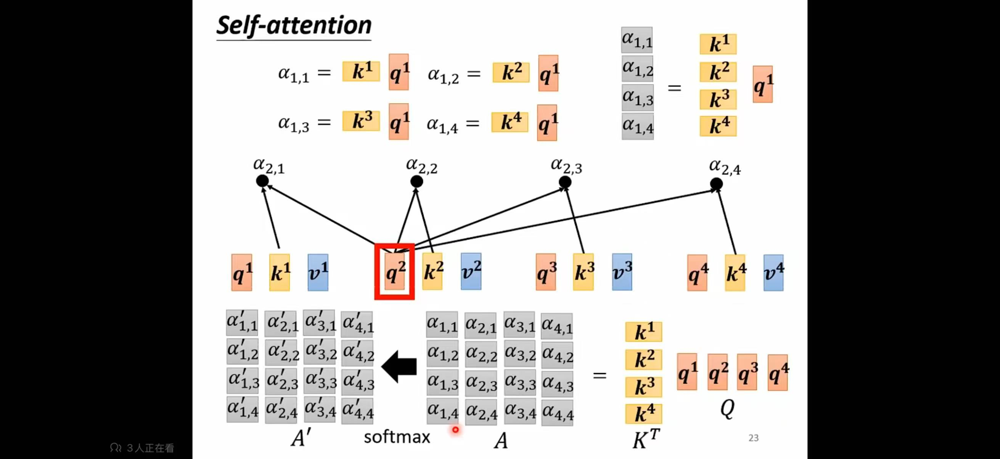
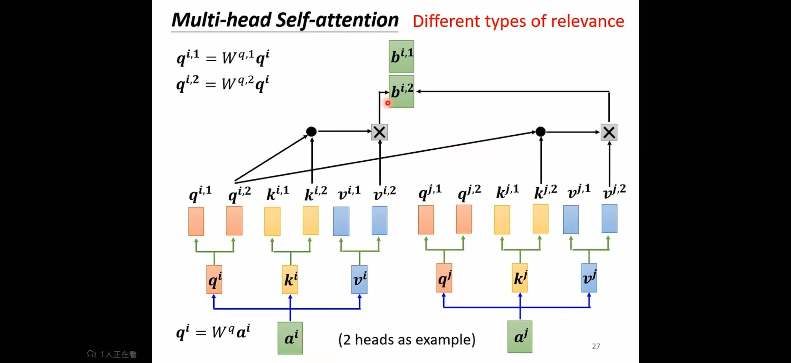
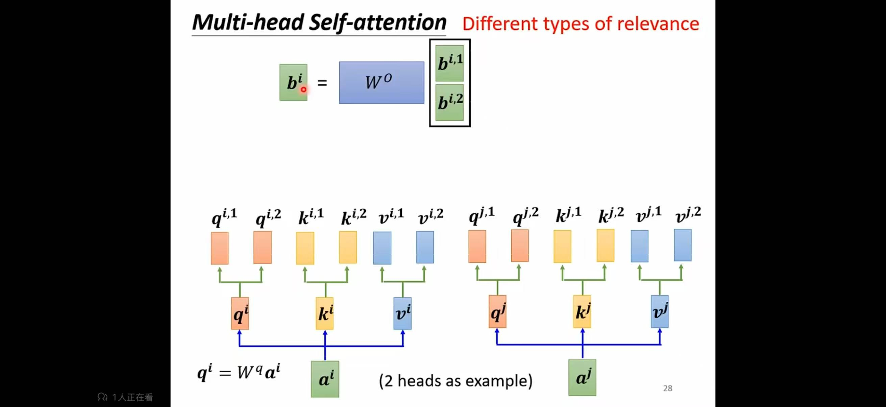

# 自注意力机制

#### 1. 单个 Query 的注意力分数

以第 1 个位置的 Query（*q*1）为例，它与所有 Key 的点积为注意力分数：

$a_{1,i}=k^i*q^1$    (i=1,2,3,4)

#### 2. 注意力矩阵（*A*）的批量计算

设所有 Query 组成矩阵*Q*=[*q*1,*q*2,*q*3,*q*4]，所有 Key 组成矩阵*K*=[*k*1,*k*2,*k*3,*k*4]，则注意力矩阵*A*为 $K^T$*与*Q的点积：

$A=K^T⋅Q$
#### 3. 归一化注意力权重矩阵（**A**′）

对 **A** 的每一行执行 Softmax 操作，得到归一化后的注意力权重：

**A**′=Softmax(**A**)

#### 4. 自注意力输出

设所有 Value 组成矩阵 **V**=[**v**1,**v**2,**v**3,**v**4]，最终输出为归一化权重与 **V** 的加权求和：

Output=**A**′⋅**V**

| 符号         | 英文全称     | 中文名称     | 核心含义                              | 对应向量 / 矩阵公式                                  |
| ------------ | ------------ | ------------ | ------------------------------------- | ---------------------------------------------------- |
| **q**\(_i_\) | Query Vector | 单个查询向量 | 第 \(i\) 个位置**想要获取的信息**     | $\mathbf{q}_i = \mathbf{x}_i \cdot \mathbf{W}^Q$ |
| **Q**        | Query Matrix | 查询矩阵     | 所有位置的查询向量集合                | $\mathbf{Q} = \mathbf{X} \cdot \mathbf{W}^Q $     |
| **k**\(_j_\) | Key Vector   | 单个键向量   | 第 \(j\) 个位置**能提供的信息**       | $\mathbf{k}_j = \mathbf{x}_j \cdot \mathbf{W}^K $ |
| **K**        | Key Matrix   | 键矩阵       | 所有位置的键向量集合                  | $\mathbf{K} = \mathbf{X} \cdot \mathbf{W}^K $     |
| **v**\(_j_\) | Value Vector | 单个值向量   | 第 \(j\) 个位置**实际包含的信息内容** | $\mathbf{v}_j = \mathbf{x}_j \cdot \mathbf{W}^V $ |
| **V**        | Value Matrix | 值矩阵       | 所有位置的值向量集合                  | $\mathbf{V} = \mathbf{X} \cdot \mathbf{W}^V $     |

# 多头注意力机制

普通自注意力是 “单头”，只能学习一种信息关联；**多头注意力**是把 Q/K/V 拆分成多个 “子向量”（对应多个 “注意力头”），每个头独立计算注意力，最后合并结果，从而捕捉更丰富的关联。

每个头的子维度： $d_k=\frac{d_{model}}{h}$

**学习权重矩阵**：

- 第 1 个头的 Query 变换矩阵： $W^{q,1}$，维度为 ${d_{model}\cdot d_k}$
- 第 2 个头的 Query 变换矩阵： $W^{q,2}$，维度为 $d_{model}\cdot d_k$

$q^{i,1}=q^i\cdot W^{q,1}$

其他的以此类推，不过 $q^{i,1}$只能与 $k^{i,1}和{k^{j,1}}$相乘不能与 $k^{j,2}$相乘，其他同理。

将多个注意力头得到的结果进行拼接，经过 $W^O$矩阵进行变换得到最终的输出

# 需要学习的参数对比

### 单头注意力

需要学习3个QKV变换矩阵

QKV变换矩阵的维度为 $d_{model}\times d_{k}$

$d_{model}$等于输入特征维度

单头注意力中查询向量的维度 $d_k$与 $d_{model}$一样，所以需要学习的参数个数为 $3 \times d_{model} \times d_{model}=3\times d_{model}^2$

### 多头注意力

需要学习3h个QKV变换矩阵和一个输出变换矩阵 $W^{O}$，h为头数

每个QKV子维度为 $d_k=d_v= \frac{d_{model}}{h} $,必须要整除, $W^{O}$为 $(h \times d_k)\times d_{model}$

如输入为n*4

2头，则W维度为4*2

q维度为1*2，同理kv也是1\*2

$A=k^{T}\cdot q=2*2$

$b_1=A\cdot v$=1*2

将 $b_1,b_2$拼接起来得到1*4

经过 $W^{O}$变换最终是1*4

需要学习的参数个数为 $h \times 3 *d_{model}*d_k+(h\times d_k)\times d_{model}=4\times d_{model}^2$                  

